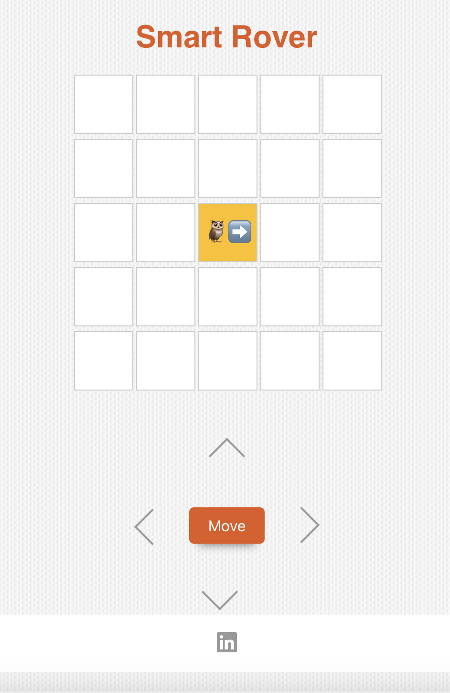

# Smart Rover with Bellroy-Inspired Design

This is a simple JavaScript web application built using **React.js** that simulates controlling a robot on a 5x5 grid. The robot can be moved in the directions "Up", "Down", "Left", and "Right" based on user input. The application also includes a LinkedIn link in the header for social connectivity.

## Features

- **Robot Movement**: Users can control the robot's movement using directional buttons (⬆️ ⬇️ ⬅️ ➡️).
- **Grid Layout**: The robot(Owl) moves on a 5x5 grid and the robot's path is tracked visually.
- **Direction Indication**: The owl emoji changes its direction based on the movement.
- **Responsive UI**: The UI is clean and minimalist, with a Bellroy-inspired look.
- **Social Link**: Includes a LinkedIn icon in the footer for connectivity.

## Live Demo

Check out the live deployed version of the project on **Netlify**:

[Live Demo on Netlify](https://smart-rover.netlify.app)

## Technologies Used

- **React.js**: Component-based JavaScript framework.
- **CSS**: For custom styling and layout.
- **FontAwesome**: For social media icons (LinkedIn).

## Getting Started

Follow these steps to get the project up and running locally.

### Prerequisites

Make sure you have Node.js and npm (Node Package Manager) installed.

- [Download Node.js](https://nodejs.org/)

### Installation

1. Clone the repository:

```bash
git clone https://github.com/dshapatel/smart-rover.git
```

2. Navigate to the project directory:

```bash
cd smart-rover
```

3. Install the required dependencies:

```bash
npm install
```

### Running the Application

1. After installation, run the development server:

```bash
npm start
```

2. Open your browser and visit `http://localhost:3000`. You should see the robot simulator with a 5x5 grid and directional buttons for controlling the robot.

### Directory Structure

```
smart-rover/
├── public/
│   ├── index.html                 # The main HTML file
├── src/
│   ├── App.js                     # Main application component
│   ├── App.css                    # Application styling
│   ├── images/                    # Folder containing images
│       └── smart-rover-image.png  # Screenshot of the app
│   └── index.js                   # Entry point for React
├── package.json                   # Project metadata and dependencies
├── README.md                      # Project documentation
└── node_modules/                  # Installed dependencies
```

## How to Use

- **Control the Robot**: Use the directional buttons (⬆️ ⬇️ ⬅️ ➡️) to move the robot around the 5x5 grid. The robot/owl will face the direction of the last button clicked.
- **LinkedIn**: Click on the LinkedIn icon in the footer to connect with the developer.

## Screenshots



## Social Media Links

- [LinkedIn](https://www.linkedin.com/in/dsha/)
